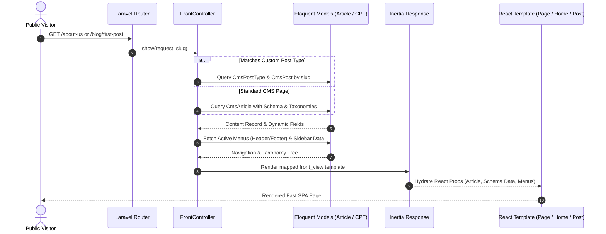
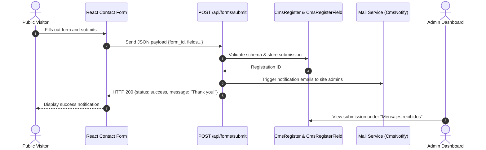
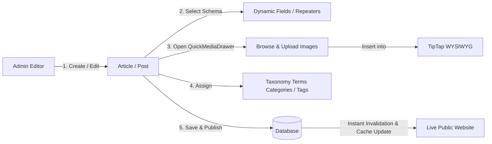

<p align="center">
  <h1 align="center">🐾 MewCMS</h1>
  <p align="center">
    <strong>The Modern, Type-Safe Open-Source CMS for High-Performance Websites</strong>
  </p>
  <p align="center">
    <a href="https://mewcms.com"><strong>mewcms.com</strong></a> &bull;
    <a href="https://deepsoft.lat"><strong>deepsoft.lat</strong></a> &bull;
    <a href="#-quick-start--installation"><strong>Quick Start</strong></a> &bull;
    <a href="#-system-architecture"><strong>Architecture</strong></a> &bull;
    <a href="#-core-workflows"><strong>System Flows</strong></a>
  </p>
  <p align="center">
    
    
    
    
    
    
    
  </p>
</p>

---

## 🌟 About MewCMS

**MewCMS** is an open-source, hybrid headless & monolithic Content Management System designed to give developers, agencies, and content creators the best possible experience when building and publishing modern websites. 

Combining the rock-solid foundation of **Laravel 12** with the reactivity and speed of **Inertia.js v2**, **React 19**, and **Tailwind CSS v4**, MewCMS eliminates traditional CMS clunkiness. You get instant Single-Page Application (SPA) navigation, full server-driven data integrity, custom schema generation, and a fluid admin interface without managing decoupled REST/GraphQL boilerplate.

> 🤝 **Collaboration & Community**:  
> MewCMS is an open CMS built for collaboration. We believe in creating a welcoming ecosystem where the community can share themes, custom post types, schemas, and improvements.  
> 
> This project is proudly developed in collaboration with [**deepsoft.lat**](https://deepsoft.lat). Explore our official portal at [**mewcms.com**](https://mewcms.com).

---

## ⚡ Key Features

- 🧩 **Dynamic Schema Engine (`CmsSchema`)**: Create custom content schemas with dynamic fields (text, textarea, repeater, images) without altering database tables or writing backend migrations.
- 📝 **Flexible Content System**: Full support for hierarchical Pages (`CmsArticle`), Custom Post Types (`CmsPostType`), and custom blog posts (`CmsPost`).
- 🏷️ **Hierarchical Taxonomies**: WordPress-style Categories and Tags with parent-child nesting, slug generation, and built-in frontend routing (`/category/{slug}`, `/tag/{slug}`).
- 🖼️ **TipTap WYSIWYG & Media Drawer**: Rich-text editing powered by TipTap, paired with the `QuickMediaDrawer` slide-out panel for fast folder navigation, drag-and-drop file uploads, and image insertion via Laravel Filemanager.
- 🗂️ **Visual Menu Builder**: Drag-and-drop structural editor with nested parent-child items, custom URLs, and automatic target article resolution.
- 📬 **Dynamic Form & Lead Engine**: Build custom contact forms (`CmsForm`), accept submissions via public JSON API (`/api/forms/submit`), store leads (`CmsRegister`), and trigger notifications (`CmsNotify`).
- 📊 **Executive Admin Dashboard**: Real-time operational widgets, interactive SVG trend charts (Articles vs. Leads, activity logs), quick action consoles, and complete audit trails (`AdmLog`).
- 🌐 **Multi-Site & Multi-Language**: Isolate schemas and templates across multiple domains (`CmsSite`) with built-in multi-language translation management (`CmsLang`, `CmsTranslate`).
- 🔍 **Native SEO & Discovery**: Automated dynamic XML sitemaps (`/sitemap.xml`), configurable `robots.txt`, and full OpenGraph social metadata out of the box.
- 🔐 **Granular Access Control**: Role-based permissions across profiles (Super Admin, Admin, Webmaster) mapped to individual modules and actions.

---

## 🏗️ System Architecture

MewCMS uses an Inertia-powered monolithic architecture: Laravel handles business logic, security, and persistence, while React 19 and Tailwind CSS render the UI seamlessly through Inertia adapters.

```mermaid
flowchart TB
    subgraph ClientLayer ["Client Layer (Browser)"]
        PublicUser["Public Visitor"]
        AdminUser["Content Editor / Admin"]
    end

    subgraph AppLayer ["Laravel 12 Application Layer"]
        Router["HTTP Kernel & Router (routes/web.php, routes/admin.php)"]
        AuthMiddleware["Authentication & Role Middleware (ACL)"]
        
        subgraph Controllers ["Controllers"]
            FrontCtrl["FrontController\n(Catch-all Dynamic Slug Resolver)"]
            AdminCtrl["Admin Controllers\n(Articles, Schemas, Taxonomies, Menus, Media)"]
            FormCtrl["Form API Controller\n(Lead Capture & Validation)"]
        end

        subgraph Services ["Core Engines & Models"]
            SchemaEngine["Schema Engine (CmsSchema)\nDynamic Fields & Repeaters"]
            ContentEngine["Content Models (CmsArticle, CmsPost, CmsMenu)"]
            TaxonomyEngine["Taxonomy Engine (CmsTaxonomy, CmsTaxonomyTerm)"]
            MediaEngine["Media & File Manager (LFM & QuickMediaDrawer)"]
        end
    end

    subgraph PresentationLayer ["Inertia.js + React 19 Frontend"]
        InertiaBridge["HandleInertiaRequests (Global Menus, Auth State, Flash)"]
        PublicViews["Public Templates (Home, Page, Post, Taxonomy, Search)"]
        AdminUI["Admin UI (TipTap Editor, Visual Menu Builder, Analytics Charts)"]
    end

    subgraph DataLayer ["Data & Storage Layer"]
        DB[(SQLite / MySQL / PostgreSQL)]
        StorageDisk["Public Storage Disk (storage/app/public)"]
    end

    PublicUser -->|GET /{slug}| Router
    AdminUser -->|Admin Dashboard Actions| Router

    Router --> AuthMiddleware
    Router --> FrontCtrl
    Router --> FormCtrl
    AuthMiddleware --> AdminCtrl

    FrontCtrl --> SchemaEngine
    FrontCtrl --> ContentEngine
    FrontCtrl --> TaxonomyEngine
    AdminCtrl --> MediaEngine
    AdminCtrl --> SchemaEngine

    FrontCtrl --> InertiaBridge
    AdminCtrl --> InertiaBridge

    InertiaBridge --> PublicViews
    InertiaBridge --> AdminUI

    SchemaEngine --> DB
    ContentEngine --> DB
    TaxonomyEngine --> DB
    FormCtrl --> DB
    MediaEngine --> StorageDisk
```

---

## 🔄 Core Workflows

### 1. Dynamic Public Page Resolution Flow

When a visitor navigates to any URL, `FrontController` resolves the hierarchy and dynamic schemas automatically:



---

### 2. Lead Capture & Form Submission Flow

Public forms generate dynamic validation and store records securely:



---

### 3. Content Authoring & Publishing Flow

Editors create rich content using schemas, drag-and-drop media, and taxonomies:



---

## 🚀 Quick Start & Installation

Follow this step-by-step guide to run MewCMS on your local development machine.

### Prerequisites

Ensure your environment meets the following requirements:
- **PHP**: `>= 8.3` (with `pdo_sqlite` or `pdo_mysql`, `mbstring`, `intl`, `bcmath`, `exif`, `gd`)
- **Composer**: `>= 2.2`
- **Node.js**: `>= 20.x` & **npm** `>= 10.x`
- **Database**: SQLite (default for quickstart), MySQL 8.0+, or PostgreSQL

---

### Step 1: Clone the Repository

```bash
git clone https://github.com/mewcms/mewcms.git
cd mewcms
```

---

### Step 2: Install PHP & JavaScript Dependencies

```bash
# Install backend composer packages
composer install

# Install frontend npm dependencies
npm install
```

---

### Step 3: Configure Environment Variables

Duplicate the example environment configuration file:

```bash
cp .env.example .env
php artisan key:generate
```

---

### Step 4: Configure the Database

#### Option A: Quickstart with SQLite (Default)
Create the local database file if it doesn't already exist:

```bash
touch database/database.sqlite
```

Ensure your `.env` contains:
```env
DB_CONNECTION=sqlite
```

#### Option B: MySQL / MariaDB
Update `.env` with your database credentials:
```env
DB_CONNECTION=mysql
DB_HOST=127.0.0.1
DB_PORT=3306
DB_DATABASE=mewcms
DB_USERNAME=your_username
DB_PASSWORD=your_password
```

---

### Step 5: Run Database Migrations & Seeders

Populate the database with the initial CMS structure, default modules, permissions, schema groups, and demo content:

```bash
php artisan migrate --seed
```

> **Default Administrator Credentials:**
> - **Username**: `dummyadmin` (or email: `dummyadmin@domain.com`)
> - **Password**: `adminPwd/247`
>
> *(Remember to change these credentials immediately in production!)*

---

### Step 6: Create the Storage Symlink

Enable public access to uploaded files and media:

```bash
php artisan storage:link
```

---

### Step 7: Launch the Development Servers

You can start both Laravel backend and Vite frontend concurrently using Composer:

```bash
composer dev
```

Or start them in separate terminal windows:

```bash
# Terminal 1: Laravel Backend
php artisan serve

# Terminal 2: Vite Dev Server
npm run dev
```

Visit the application in your browser:
- **Public Website**: [http://localhost:8000](http://localhost:8000)
- **Admin Control Panel**: [http://localhost:8000/admin](http://localhost:8000/admin)

---

## 🛠️ Code Quality, Linting & Testing

MewCMS enforces strict code standards across both PHP and TypeScript.

```bash
# Run automated feature & unit test suite (Pest)
php artisan test

# Verify TypeScript types
npm run types

# Run ESLint check & automatic fixes
npm run lint

# Format frontend resources with Prettier
npm run format

# Compile production assets with Vite
npm run build
```

---

## 🐳 Production Deployment & Docker

MewCMS includes a production-ready, multi-stage `Dockerfile` and automated deployment scripts.

### Docker Multi-Stage Build

Build and run the production container locally:

```bash
# Build the Docker image
docker build -t mewcms:latest .

# Run container on port 8080
docker run -d \
  -p 8080:8080 \
  -e APP_KEY="base64:yourGeneratedKeyHere=" \
  -e RUN_SEED="true" \
  --name mewcms-app \
  mewcms:latest
```

The container automatically:
1. Generates `APP_KEY` if not set.
2. Creates the storage symlink.
3. Executes database migrations (`php artisan migrate --force`).
4. Seeds the database on first boot if `RUN_SEED=true`.
5. Caches routes, configurations, and views (`config:cache`, `route:cache`, `view:cache`).
6. Starts the high-performance runtime server.

### Deploying to Render or VPS

A ready-to-use [`render.yaml`](file:///Users/fischer/Projects/mewcms/render.yaml) configuration is included in the project for zero-friction cloud deployment.

---

## 🤝 Contributing & Community

We are building MewCMS to be the most developer-friendly, flexible open CMS in the ecosystem, and we warmly welcome your contributions!

### How You Can Help:
1. **Star & Fork** the repository.
2. **Report Bugs or Suggest Features** via [GitHub Issues](https://github.com/mewcms/mewcms/issues).
3. **Submit Pull Requests**: Ensure tests pass (`php artisan test`) and code is linted (`npm run lint`, `npm run types`).
4. **Build Custom Schemas & Themes**: Share your dynamic templates with the community.

Please review our contribution guidelines and code of conduct before opening pull requests.

---

## 🏢 Credits & Acknowledgments

- **Developed in collaboration with**: [**DeepSoft** (deepsoft.lat)](https://deepsoft.lat)
- **Official Website**: [**mewcms.com**](https://mewcms.com)
- **Core Technology Partners**: [Laravel](https://laravel.com), [Inertia.js](https://inertiajs.com), [React](https://react.dev), [Tailwind CSS](https://tailwindcss.com), [TipTap](https://tiptap.dev).

---

## 📄 License

MewCMS is open-source software licensed under the **[MIT License](LICENSE)**. You are free to use, modify, distribute, and build commercial or non-commercial websites with it.
